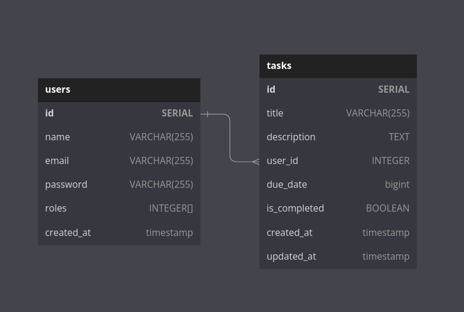

# gotodotasks
The `gotodotasks` web application is a simple todo list app that provides two main services, namely `user` service and `task manager` service. The user service handles user authentication and registration, while the task manager service handles the creation, retrieval, updating, and deletion of todo tasks.

The backend of the application is built using `Golang` and `microservices` architecture, where each service is implemented as a separate microservice. We used `grpc-gateway` and `protobuf` to define our API and `PostgreSQL` for our database. `Traefik` was used as a load balancer to distribute incoming traffic among the microservices.

For the frontend, we used an open-source HTML/CSS/JS template for a todo app and modified the JS code to call our APIs. We also implemented a `webserver` service whose job is to render HTML templates for the frontend. Finally, we deployed the application using `AWS EC2` virtual machines, `Docker`, and `Docker Compose`.

we also used `Justfile` as a command runner to manage our `build` and `deployment` processes. Justfile allowed us to define and run complex build and deployment tasks with ease

We also used `Goose` for handling database migrations, which helped us to manage changes to our database schema and keep our database up-to-date with the latest changes to our application. By using Goose, we were able to automate the process of migrating our database, which saved us time and effort in the long run.

## Challenges and Solutions
One of the main challenges we faced during the development process was to ensure the `compatibility` and `consistency` between different microservices. To address this challenge, we used `protobuf` for defining our API, which helped us to ensure the compatibility and consistency between different microservices.

Another challenge was to ensure the `reliability` and `availability` of the application. To address this, we used `Traefik` as a load balancer, which helped us to distribute incoming traffic among different microservices and ensure the availability of the application.

## Testing
For testing, we used `Postman` to test our API manually. We tested all the functionalities of both the user service and the task manager service.

## database schema
The database schema is shown below to provide an overview of the database structure



## traefik
traefik container expose two ports `80` for web entrypoints and `8080` for services dashboard panel


## grpc gateway
Each microservice has two ports, one for supporting `gRPC` over `HTTP2` and another for supporting traditional `HTTP1` requests.


### Available commands
you check available commands by running `just --list`
```sh
    build
    clean
    create-gomigrate MigrateName # create new golang migration
    create-sql MigrateName       # create new sql migration
    dcompose-clean               # down and clean all compose file containers
    dcompose-stop                # stop docker compose containers
    dcompose-up                  # run docker compose up
    proto                        # format and lint and generate proto file using buf
    run
    run-migrations               # run all migrations

```
### build
build the project using following command:
```sh
just build
```
### generate proto

```sh
just proto
```

### start all services containers

```sh
just dcompose-up
```

## refrence
+ [gRPC](https://grpc.io)
- [gRPC gateway](https://github.com/grpc-ecosystem/grpc-gateway)
+ [traefik](https://doc.traefik.io/traefik/)
- [goose migrations](https://github.com/pressly/goose)
+ [postgres](https://www.postgresql.org/)
- [todo app frontend](https://github.com/hariramjp777/frontend-todo-app)
+ [docker compose](https://docs.docker.com/compose/)
